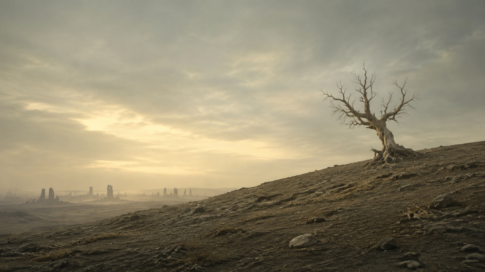

# Silo for Omarchy

A theme inspired by **Silo**, with 23 wallpapers and **The Cleaning** minigame.


## Install

Paste into a terminal to install the theme, add the game shortcut, and start playing:

```bash
omarchy theme install https://github.com/ripple0328/omarchy-silo-theme &&
python3 "$HOME/.config/omarchy/themes/silo/companion/launch.py"
```

## Play

Press **Super + Alt + Space**, search **Silo: The Cleaning**, and press **Enter**.

- Select **Begin cleaning**, then hold and drag to wipe the lens.
- Clear the view before your 30 seconds of air run out.
- Select **Pause** to pause, **Again** to replay, or **Exit** to quit.
- Keyboard: focus the lens, hold **Space**, and use the **arrow keys** to wipe. Press **P** to pause.



## Change wallpaper

```bash
omarchy theme bg next
```


## Update

```bash
omarchy theme install https://github.com/ripple0328/omarchy-silo-theme
```

Reopen **Silo: The Cleaning** to play the updated game.

[Wallpaper credits](WALLPAPERS.md) · Unofficial fan theme. The Cleaning landscape is AI-generated artwork.
