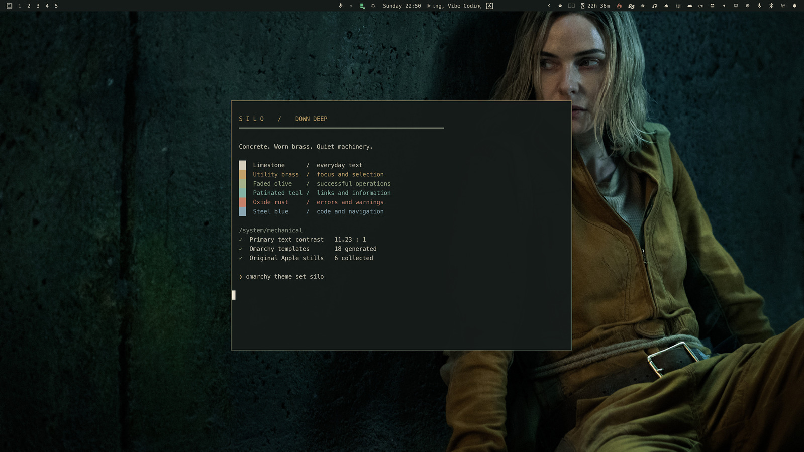
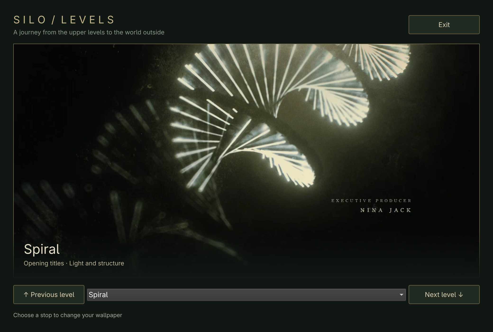
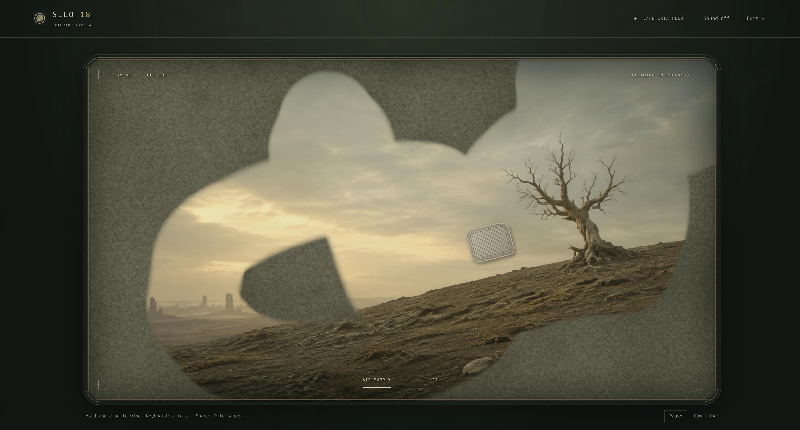
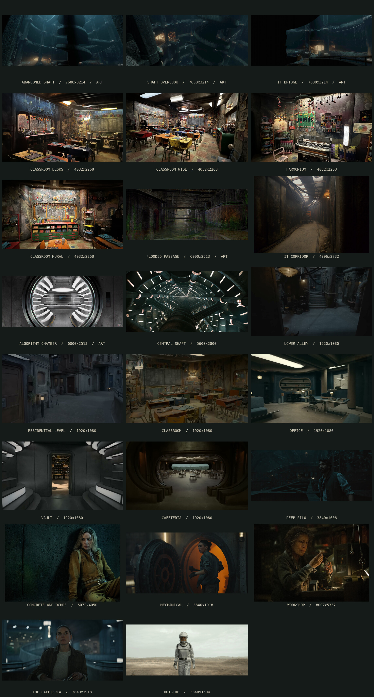

# Silo for Omarchy

A theme inspired by **Silo**, with 28 wallpapers and **The Cleaning** minigame.



## Install

Paste into a terminal to install the theme and app shortcuts:

```bash
omarchy theme install https://github.com/ripple0328/omarchy-silo-theme &&
python3 "$HOME/.config/omarchy/themes/silo/companion/install.py"
```

## Explore the levels

Open the app launcher with **Super + Alt + Space** and choose **Silo: Levels**.
Use **Previous level** / **Next level**, or pick a stop to change your wallpaper with a transition. Close the app to keep your chosen wallpaper.



## Play

Open the app launcher with **Super + Alt + Space**, search **Silo: The Cleaning**, and press **Enter**.

- Select **Begin cleaning**, then hold and drag to wipe the lens.
- Clear the view before your 30 seconds of air run out.
- Select **Pause** to pause, **Again** to replay, or **Exit** to quit.
- Keyboard: focus the lens, hold **Space**, and use the **arrow keys** to wipe. Press **P** to pause.





[Wallpaper credits](WALLPAPERS.md) · Unofficial fan theme. The Cleaning landscape is AI-generated artwork.
