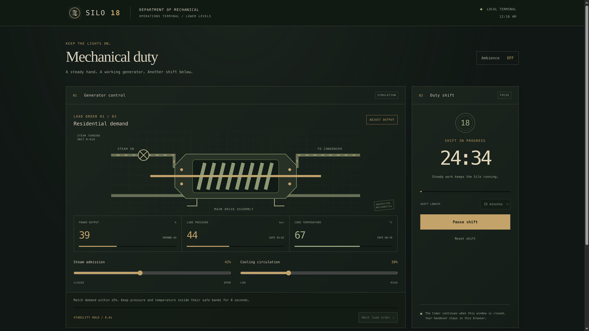
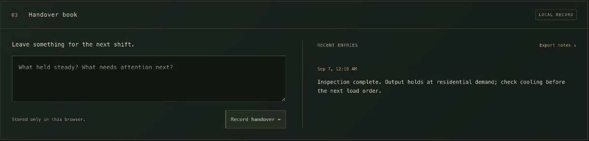

# Silo for Omarchy

Charcoal concrete, aged brass, faded olive, and industrial teal — with architecture, empty sets, and character scenes from **Silo**.


## Install

```bash
omarchy theme install https://github.com/ripple0328/omarchy-silo-theme
```

## Use

```bash
omarchy theme set silo
omarchy theme bg next
```

Twenty-three wallpapers, including **ten new production images**: five concept paintings at 6000–7680 pixels wide and five empty-set photographs around 4K. Abandoned Shaft is the default. Original character photography reaches **8002×5337**. The older 1080p set-tour frames remain available for variety.

## Mechanical companion

A local Silo-inspired app with a three-stage generator-balancing puzzle, a focus timer, a handover notebook, and optional machinery ambience (off by default).

### Screenshots

**Generator console and shift timer** — match each load order, hold the safe bands for eight seconds, and work a 15/25/45/60-minute shift.



**Handover book** — save notes for your next shift and export a JSON backup. This screenshot uses example notes.



### Install

Requires Omarchy, Python 3, a systemd user session, and an Omarchy-supported web-app browser. No additional Python or JavaScript packages are needed.

1. Install the theme from GitHub (skip this if already installed):

   ```bash
   omarchy theme install https://github.com/ripple0328/omarchy-silo-theme
   ```

2. Install the optional companion and application launcher:

   ```bash
   python3 ~/.config/omarchy/themes/silo/companion/install.py
   ```

The companion installs separately from the theme. Installing a theme alone does not run the companion installer.

### Launch

Open your application launcher, search for **Silo Mechanical**, and select it. Or launch from a terminal:

```bash
python3 ~/.local/share/silo-mechanical/launch.py
```

Both methods start the local service and open the console in an app window. Once running, you can also visit [the local console](http://127.0.0.1:48118/) in a browser. Use the same browser profile to keep your timer and notes together.

### Use

- **Generator:** adjust steam and cooling to match demand within ±5%, keeping pressure and temperature in their safe bands. Hold steady for eight seconds, then select **Next load order**. Complete all three orders to certify the inspection.
- **Shift:** choose a duration and select **Begin shift**. Pause, resume, or reset whenever needed. The timer catches up after closing the window or suspending the computer; it does not send background notifications.
- **Handover:** write a note and select **Record handover**. Use **Export notes** to save a backup. Notes, drafts, and timer state stay in this browser’s local storage; clearing browser data removes them.
- **Ambience:** turn the optional machinery hum on or off with the top-right button.

All instruments are fictional. The puzzle restarts on reload. The app works offline and listens only on `127.0.0.1:48118`; the service starts on demand, without login autostart.

### Update or stop

To update both the theme and companion:

```bash
omarchy theme install https://github.com/ripple0328/omarchy-silo-theme
python3 ~/.config/omarchy/themes/silo/companion/install.py
```

Reopen or reload the app after updating. Updates preserve browser-stored notes and timer state.

Closing the window leaves the lightweight local service running. To stop it:

```bash
systemctl --user stop silo-mechanical.service
```

Launching **Silo Mechanical** starts it again.

## Wallpaper previews


See [wallpaper credits](WALLPAPERS.md) for sources and resolution details. This unofficial fan theme grants no rights to the show's imagery.
